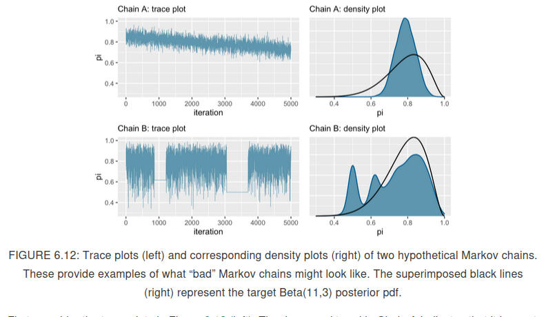

```{r include=FALSE}
library(tidyverse)
library(janitor)
library(rstan)
library(bayesplot)
```

There are two steps involved in defining a `rstan` model:
1. define Bayesian model structure.
2. simulate the posterior.

Let us look at Beta-Binomial example.

$$
Y | \pi \sim Binom(10,\pi) \\
\pi \sim Beta(2,2)
$$

By Beta-Binomial conjugacy, we know that the posterior is $\pi | Y=y \sim Beta(2 + y, 2+10-y)$. The function `stan()`, loosely speaking, chooses an appropriate MCMCM algorithm and runs it to produce apprximate samples from Beta-Binomial posterior.

```{r}
## step 1: define model structure as character string

bb_model <- "
    data {
        int<lower = 0, upper = 10> Y;
    }
    parameters {
        real<lower = 0, upper = 1> pi;
    }
    model {
        Y ~ binomial(10,pi);
        pi ~ beta(2,2);
    }
"

## step 2: simulate posterior using stan() function

bb_sim <- stan(model_code = bb_model,  # character string defining model
               data = list(Y = 9),     # list of observed data
               chains = 4,             # number of parallel Markov chains to run
               iter = 5000 * 2,        # number of iterations or length of each Markov chain   # nolint
               seed = 84735)
```

The R Object `bb_sim` is of the type `stanfit`.
```{r} 
class(bb_sim)
```

* The object `bb_sim` contains four parallel markov chains run for 10,000 iterations each. If we don't exclude any of the data points, we have a combined **Markov chain sample size** of 40,000. 

* **Burn-in** is the practice of discarding the first portion of Markov chain values. 

```{r}
# the first 5000 samples from each Markov chain are removed as part of burn-in
as.array(bb_sim, pars = "pi") %>%
  dim()
```

* The $\pi$ values under the columns `chain:1` come from a Markov Chain. We see that, for a fixed chain, parameter $\pi$ traverses the sample space or range of posterior plausible $\pi$ values.
```{r}
# first five realizations of the four parallel MC chains
as.array(bb_sim, pars = "pi") %>%
  head()
```

* A MC **trace plot** illustrates this traversal, plotting parameter values ($\pi$) on y-axis against iteration number on x-axis. Such a trace plot illuminates the longitudinal behavior of Markov chains. For this, we can use the function `mcmc_trace()` from the package `bayesplot`. 

```{r}
mcmc_trace(bb_sim, pars = "pi")
```

* In addition to how the chain traverses the sample space, we also want to look at the distribution of values these chains visit while ignoring the order of visits. The histogram we get, will be a histogram constructed using all 20,000 values (from all four chains). This histogram will be a good approximation of the **target distribution** or posterior distribution.

```{r}
# histogram of Markov chain values
mcmc_hist(bb_sim, pars = "pi") +
  yaxis_text(TRUE) +
  ylab("count")
```


```{r}
# density plot of Markov chain values
mcmc_dens(bb_sim, pars = "pi") +
  yaxis_text(TRUE) +
  ylab("count")
```

* When we are unable to provide derive a posterior, simulated samples provide a crucial _approximation_. Simulations aren't perfect. This motivates us towards **Markov Chain Diagnostics**.   MCMC diagnostics deal with the following questions:
1. How does a "good" Markov chain look like?
2. How to tell if our MC samples provide a "reasonable" approximation to the posterior?
3. How "big" should our MC sample size be?

* Answering the above diagnostics related questions is both an art and science. With experience, one gets a feel for "good" and "bad" Markov chains. Chapter 6 of the textbook looks at some visual and numerical diagnostic tools. These tools need to be used _holistically_
    * Visual diagnostic tools: **trace plots, parallel chains**.
    * numerical diagnostics: **effective sample size, autocorrelation** and **R-hat**.
* A "good" trace plot looks like a bunch of white noise with no discernible trends or notable phenomena. This nothingness implies that the **chain is stable**. The traceplots below are taken from Ch6 of the Bayesrules textbook.




